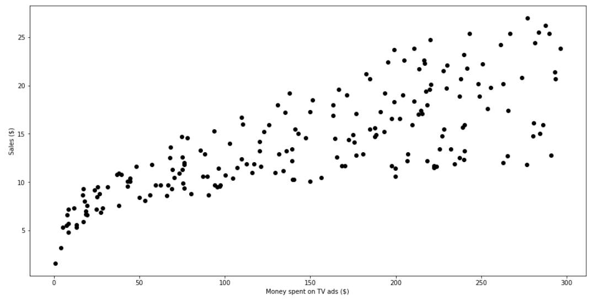

# Sales Estimator
ELinear Regression is a machine learning algorithm based on supervised learning. It performs a regression task. Regression models a target prediction value based on independent variables. It is mostly used for finding out the relationship between variables and forecasting.

It performs the task to predict a dependent variable value (y) based on a given independent variable (x). So, this regression technique finds out a linear relationship between x (input) and y(output).

The scattered data is presented as:

Simple linear regression has only one x and one y variable. Multiple linear regression has one y and two or more x variables. For instance, in above case, I have predicted sales on the basis of advertisement on TV.
The graph for Simple Linear Regression is:

